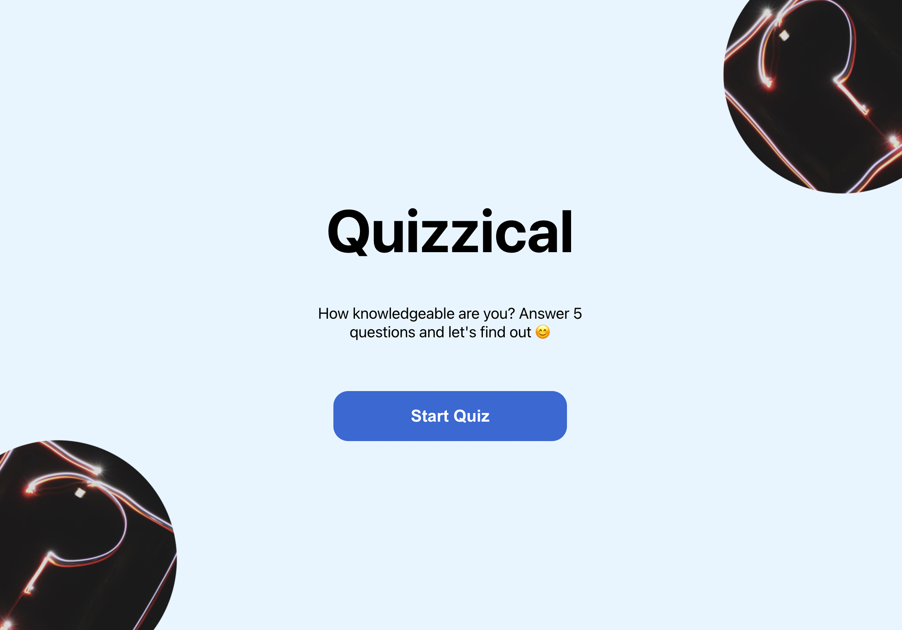
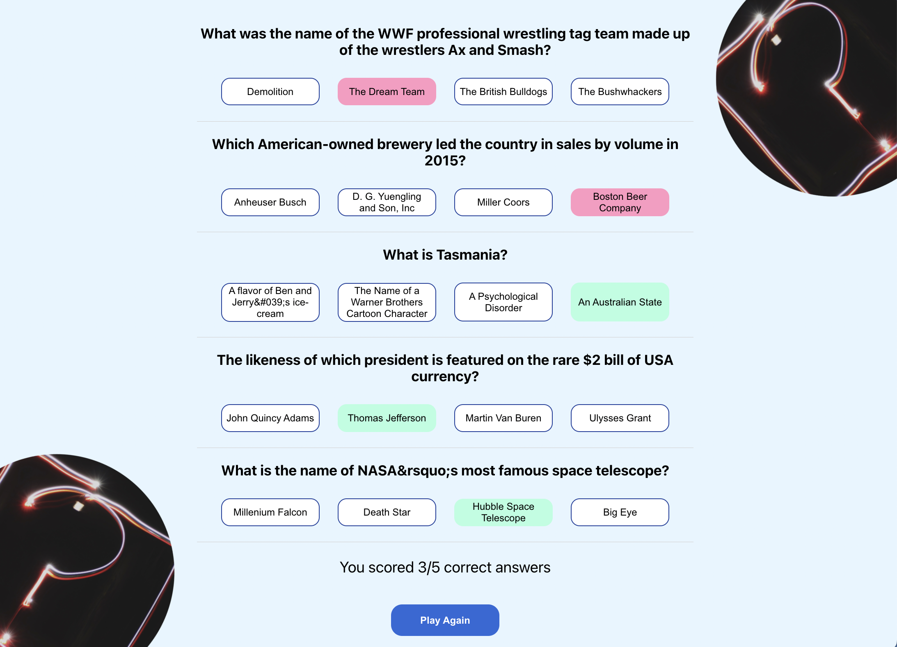
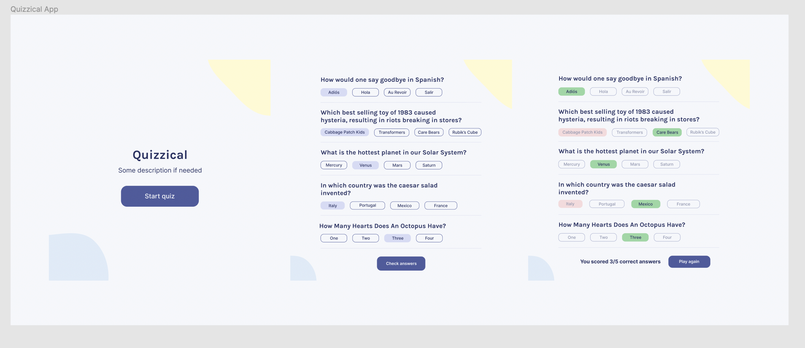

# Quizzical

Last solo project from Scrimba React course.

This project was bootstrapped with [Create React App](https://github.com/facebook/create-react-app).

---
## Available Scripts

In the project directory, you can run:

### `npm start`

Runs the app in the development mode.\
Open [http://localhost:3000](http://localhost:3000) to view it in your browser.

### `npm test`

Launches the test runner in the interactive watch mode.

---
## Usage

When you launch the app this is the homepage:

This is how the quiz page looks like after you selected the answers and clicked on Check Answers:

---

The design was provided by the Scrimba course. I slightly modified it.

---